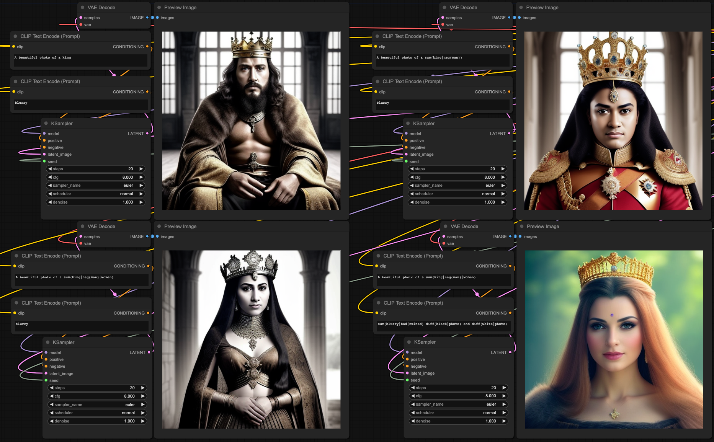

# ClipStuff
## Basic Instructions.
Clone repo into custom_nodes folder.
Install the requirements.txt file via pip.

Pass CLIP output from Load Checkpoint into SpecialClipLoader node, then use the outputted clip with standard Clip Text Encode.

See example workflow in examples folder.

### Example Photo


## Functions

## Syntax Elements

1. **Embedding**:
    - Syntax: `embedding:WORD`
    - Example: `embedding:face_vector`
    - Represents a named vector embedding(Textual Inversion).

2. **Word**:
    - Syntax: Any alphanumeric word including characters such as `,`, `_`, and `-`.
    - Example: `cat, dog_face, id_123`
    - Represents simple words or identifiers.

3. **Quoted String**:
    - Syntax: A string enclosed within double or single quotes. You can escape quotes inside the string using a backslash (`\`).
    - Example: `"Hello World"`, `'It\'s a sunny day'`
    - Represents string literals.

## Functions

Here are the available functions and their usage:

1. **Sum Function**:
    - Syntax: `sum(arg1 | arg2 | ... | argN)`
    - Adds together multiple embeddings.
    - Example: `sum(embedding:face1 | dog)`

2. **Negation Function**:
    - Syntax: `neg(arg)`
    - Negates the output.
    - Example: `neg(A embedding:happycats outside)`

3. **Normalization Function**:
    - Syntax: `norm(arg)`
    - Normalizes the given vector embedding.
    - Example: `norm(sum(embedding:face1 | embedding:face2))`

4. **Difference Function**:
    - Syntax: `diff(arg1 | arg2 | ... | argN)`
    - Computes the difference between multiple vector embeddings.
    - Example: `diff(embedding:face1 | embedding:face2)`

### Notes on Arguments:
- Each function takes one or more arguments.
- An argument (`arg`) can be an embedding, a word, another function, or a quoted string.
- For functions that accept multiple arguments, they are separated by the `|` symbol.

## Examples

1. Add two embeddings and normalize the result:
   ```
   norm(sum(cat | dog | horse | parrot))
   ```

2. Negate an embedding:
   ```
   neg(embedding:body_vector)
   ```

3. King - Man + Woman = Queen:
   ```
   sum(diff(king|man)|woman)
   ```
   or
   ```
   sum(king|neg(man)|woman)
   ```
   ```
